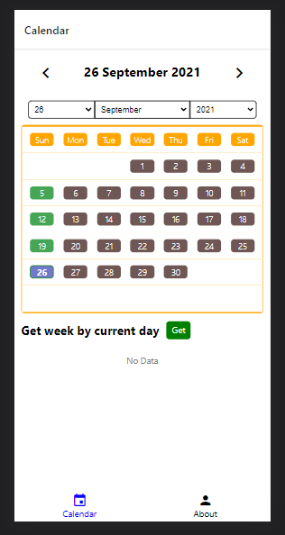
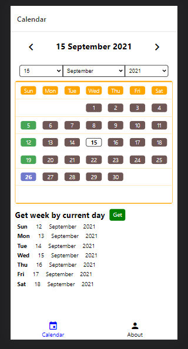
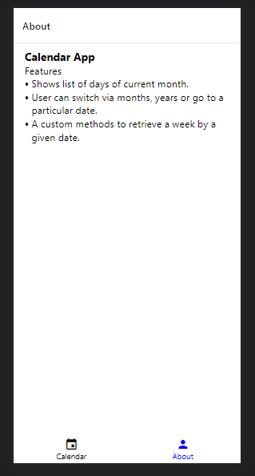

# Calendar App | React Native

  
  
  

## Requirements

    $ Android Emulator, or
    $ Android Phone

## Insatll Dependencies

    $ npm install

## Run android app

    $ npx react-native run-android

